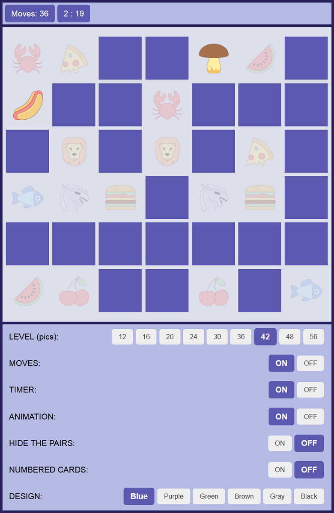

# Memory Game

At the beginning of the game, all cards are closed. The player opens one card at a time. If the images are the same, the cards disappear. The game continues until all the cards are gone. The game has 9 levels - from 12 to 56 cards. The player can play with a time and/or turn limit, change the color theme and other settings.

Demo link is [here]( https://kulyk-volodymyr.github.io/Memory-game/).

The game is designed not for commercial usage. All images are taken from from [Icons8](https://icons8.com/).
